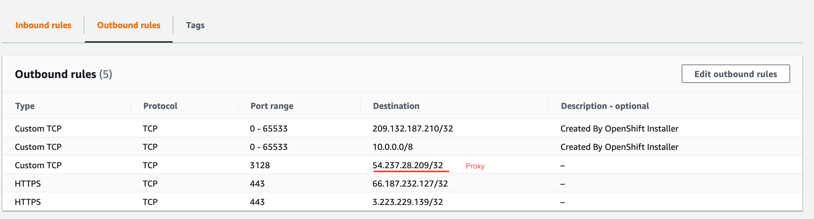

## Background
There has use case to support running observability in disconnected environment. One approach is setup proxy to allow observability to connect with object storage and 3rd-party tools, e.g.: slack/pageduty.

OpenShift provides configuring the global proxy so that the OLM can automatically configure the proxy environment into the operator. Refer to https://docs.openshift.com/container-platform/4.6/operators/admin/olm-configuring-proxy-support.html

## Proxy
Here I created a VM in AWS and installed squid to setup the proxy. Spend more time to verify if the proxy works or not. Actually, it is easy to setup and work as design. But in China Firewall detects that you use the agent to access the wall URL, on the malicious modification of your request, the ACK of your client TCP modified, causing the server to reset the connection.  

## Simuate Test

1. Install the OpenShift + ACM (w/ observability enabled) in AWS.

2. We can configure the Outbound rules to disable the outbound for the cluster. I am using SNO cluster, so just disable outbound for one node in the security group.



After that, we can see that the thanos compact cannot connect to object storage. That is by design.

3. Manually configure the proxy into subscription
```
  spec:
    channel: release-2.3
    config:
      env:
      - name: HTTP_PROXY
        value: http://54.237.28.209:3128
      - name: HTTPS_PROXY
        value: http://54.237.28.209:3128
      - name: NO_PROXY
        value: .cluster.local,.svc,10.128.0.0/14,127.0.0.1,172.22.0.0/24,172.30.0.0/16,192.168.123.0/24,api-int.obs-china-aws-480-sno-fxw45.dev05.red-chesterfield.com,localhost
```
You can see that all the subscription installed operators will be restarted with the above environment variables injected.

4. Then you can the thanos compact can be running successfully.

5. For the alertmanager, it can be configured via `alertmanager.yaml`. for example:
`oc set data secret/alertmanager-config --from-file=alertmanager.yaml=alertmanager.yaml`
alertmanager.yaml
```
global:
  slack_api_url: xxx
  http_config:
    proxy_url: http://54.237.28.209:3128
route:
  receiver: default-receiver
  group_by: ['alertname', 'cluster']
  repeat_interval: 30ms
  matchers:
  - severity="critical"
receivers:
  - name: default-receiver
    slack_configs:
    - channel: observability-test
      send_resolved: true
      actions:
        - name: "links"
          text: "Grafana :grafana:"
          type: "button"
      footer: |
        {{ .CommonLabels.cluster }}
      mrkdwn_in:
        - text
        - actions
      text: |-
        {{ range .Alerts }}
          :failed: - *Alerts:* {{ .Annotations.summary }}
          :green_book: - *Description:* {{ .Annotations.description }}
          :clipboard: - *Details:*
          {{ range .Labels.SortedPairs }} • *{{ .Name }}:* `{{ .Value }}`
          {{ end }}
        {{ end }}
      title: '[{{ .Status | toUpper }}] {{ .CommonLabels.alertname }} ({{ .CommonLabels.severity }})'
```
Then you can receive the critial alerts from slack channel if there has alert fired.