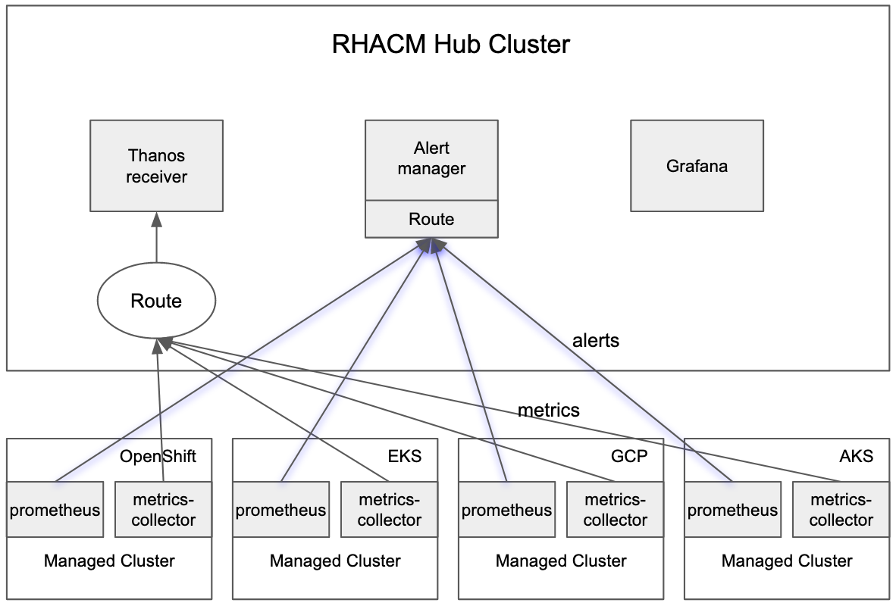

## Introduction
With the observability service enabled, you can use Red Hat Advanced Cluster Management for Kubernetes (RHACM) to gain insight about and optimize your managed clusters. If the managed cluster is OCP 4.8+ or *KS cluster, you can see alerts from all the managed clusters in the hub cluster. 

You also can configure [forward alerts](https://access.redhat.com/documentation/en-us/red_hat_advanced_cluster_management_for_kubernetes/2.4/html/observability/observing-environments-intro#forward-alerts) with an external notification system.

In this blog, I will introduce how to use [amtool](https://github.com/prometheus/alertmanager#amtool) to manage the alerts.

## amtool

`amtool` is a cli tool for interacting with the [alertmanager](https://prometheus.io/docs/alerting/latest/alertmanager/) API. It is bundled with all releases of Alertmanager. You can install in local with `go get github.com/prometheus/alertmanager/cmd/amtool`.

Note: If you are the user who can access the `observability-alertmanager-0` pod directly, you can use `amtool` which is bundled with that pod. Use `amtool alert --alertmanager.url=http://localhost:9093` to list alerts.

## Connect to RHACM Alertmanager

RHACM exposes alertmanager api via route. You can get the alertmanager url with `oc get route alertmanager -n open-cluster-management-observability -o jsonpath="{.spec.host}"`

Before connecting to alertmanager, you also need to pass `bearer-token` to `amtool`. You can get the bearer token from RHACM console `Configure client` or fetch the token with `oc whoami -t` if you have logged in your OCP cluster.

You can create a config file in YAML format from one of two default config locations: $HOME/.config/amtool/config.yml or
/etc/amtool/config.yml. Here is an example content:
```
alertmanager.url: https://alertmanager-open-cluster-management-observability.apps.xxx
tls.insecure.skip.verify: true
bearer-token: sha256~xxxxxxx
```
## Configuration
You can use `amtool` to understand the current alertmanager configuration.
```
global:
  resolve_timeout: 5m
  http_config: {}
  smtp_hello: localhost
  smtp_require_tls: true
  slack_api_url: <secret>
  pagerduty_url: https://events.pagerduty.com/v2/enqueue
  hipchat_api_url: https://api.hipchat.com/
  opsgenie_api_url: https://api.opsgenie.com/
  wechat_api_url: https://qyapi.weixin.qq.com/cgi-bin/
  victorops_api_url: https://alert.victorops.com/integrations/generic/20131114/alert/
route:
  receiver: default-receiver
  group_by:
  - alertname
  - cluster
  repeat_interval: 45m
receivers:
- name: default-receiver
  slack_configs:
  - send_resolved: true
    http_config: {}
    api_url: <secret>
...
```

## Examples

Now it is ready to use amtool to manage alerts.

### View all currently firing alerts:
```
$ amtool alert
Alertname          Starts At                Summary                                           State
KubeCPUOvercommit  2021-10-27 07:47:32 UTC  Cluster has overcommitted CPU resource requests.  active
```

### View all currently firing alerts with extended output:
```
$ amtool alert -o extended
Labels                                                                                                                                                                                                                                                                                                                                                                                                             Annotations                                                                                                                                                                                   Starts At                Ends At                  Generator URL                                                                                                                                                                                                                                                                                                                                      State
alertname="KubeCPUOvercommit" cluster="cyang2-kind" severity="warning"                                                                                                                                                                                                                                                                                                                                             description="Cluster has overcommitted CPU resource requests for Pods and cannot tolerate node failure." summary="Cluster has overcommitted CPU resource requests."                           2021-10-27 07:47:32 UTC  2021-11-10 13:50:02 UTC  http://prometheus-k8s-0:9090/graph?g0.expr=sum%28namespace_cpu%3Akube_pod_container_resource_requests%3Asum%29+%2F+sum%28kube_node_status_allocatable%7Bresource%3D%22cpu%22%7D%29+%3E+%28count%28kube_node_status_allocatable%7Bresource%3D%22cpu%22%7D%29+-+1%29+%2F+count%28kube_node_status_allocatable%7Bresource%3D%22cpu%22%7D%29&g0.tab=1  active
```

### Silence an alert:
```
$ amtool silence add alertname=KubeCPUOvercommit --comment=acked
290bb29e-6457-47b0-b10d-140b10418c4c
```
### Silence all alerts with the matchers
RHACM adds the `cluster` label for each alert. RHACM uses this label to identify where the alert is from. So you can slience all alerts from 1 cluster:
```
$ amtool silence add cluster="local-cluster" --comment=acked
48ccecdc-abb1-4196-83fd-593ba010ddf3
```
```
$ amtool silence add alertname="KubeCPUOvercommit" cluster=~".+1" --comment=acked
18abf36d-b01e-46a0-ba1a-b814acb4bae0
```
As well as direct equality, regex matching is also supported. The '=~' syntax(similar to Prometheus) is used to represent a [regex](https://github.com/google/re2/wiki/Syntax) match. Regex matching can be used in combination with a direct match. This statement will add a silence that matches alerts with the alertname="KubeCPUOvercommit" and cluster is at end of `1` label value pairs set. 
### View silences:
```
$ amtool silence query
ID                                    Matchers                       Ends At                  Created By  Comment
290bb29e-6457-47b0-b10d-140b10418c4c  alertname="KubeCPUOvercommit"  2021-11-10 14:54:44 UTC  chuyang     acked
```

### Expire a silence:
```
$ amtool silence expire 290bb29e-6457-47b0-b10d-140b10418c4c
```

### Expire all silences:
```
$ amtool silence expire $(amtool silence query -q)
```